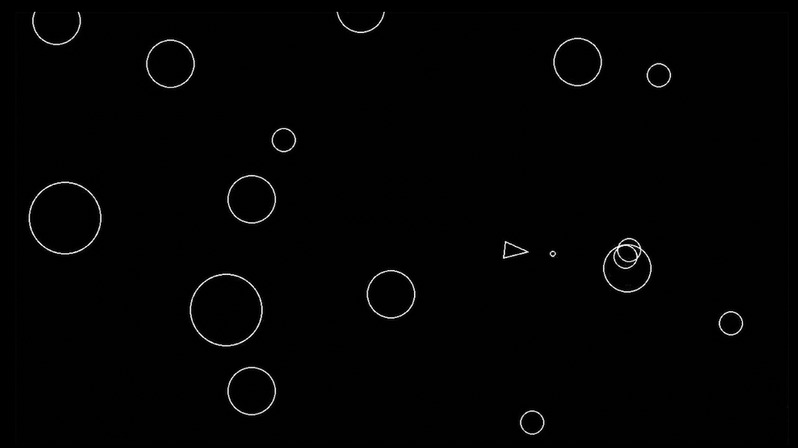

# Asteroids

A simple Asteroids clone built with Python and Pygame.  

---

## Features

- Classic arcade-style gameplay
- Player ship with movement and shooting
- Asteroids that split into smaller pieces when shot
- Collision detection and game over state

---

## Screenshot




---

## How to Run using using 'uv'

1. **Clone the repo:** 
    ```bash
    git clone https://github.com/krz-sta/asteroids
    ```
2. **Change working directory:**
    ```bash
    cd asteroids
    ```

3. **Initialize uv:**
    ```bash
    uv init
    ```

4. **Create a new virtual environment**:
    ```bash
    uv venv
    ```

5. **Initialize the virtual environment:**
    ```bash
    source .venv/bin/activate
    ```

6. **Add dependencies:**
    ```bash
    uv add -r requirements.txt
    ```

7. **Run the game:**
    ```bash
    uv run main.py
    ```

---

## Controls

- **W, A, D:** Move the ship
- **Spacebar:** Shoot

